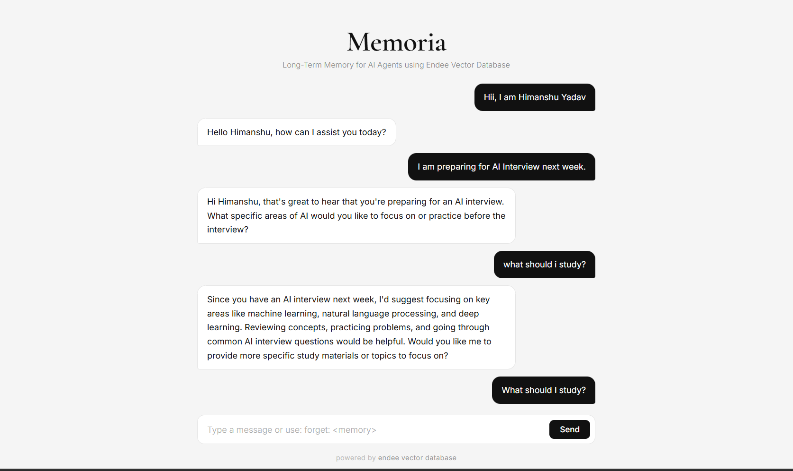
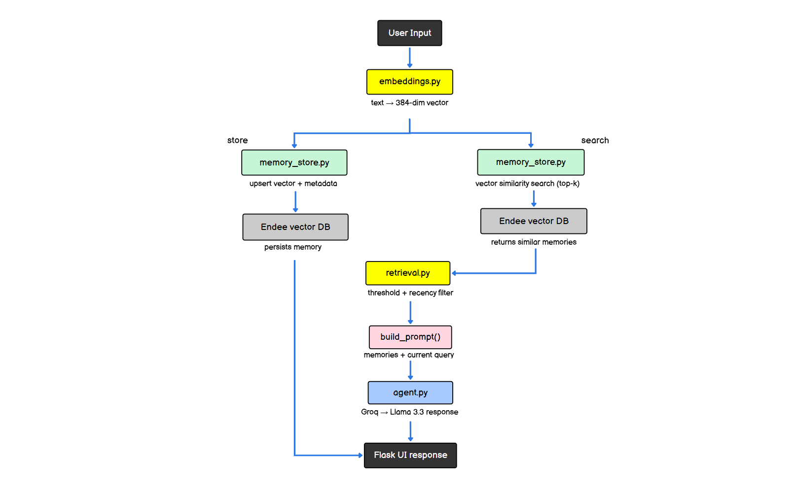

# Memoria

### Persistent Memory System for AI Agents using Endee Vector Database

Memoria is a lightweight memory layer for AI assistants. It allows an agent to store conversations as embeddings, retrieve relevant past interactions using vector similarity search, and update or delete memories when needed.

The goal is simple: give AI agents a way to remember.


## Why Memoria

Large Language Models are stateless by default. Each request is processed independently, which means the model does not retain information from previous conversations. This makes it difficult to build assistants that maintain long-term context.

Memoria solves this by storing conversational messages as embeddings inside a vector database. During each interaction, relevant past memories are retrieved and injected into the prompt so the model can respond with contextual awareness.

## Demo

The demo below shows memory storage, semantic recall, and deletion using the `forget:` command.

[](https://youtu.be/tInKAfTj4S4)
_click the image to play the video demo._

## Example Interaction
```
User: My name is Himanshu
Assistant: Nice to meet you. How can I help you today?

User: I am preparing for AI interviews next week
Assistant: Good luck with your preparation. Would you like help with specific topics?

User: What should I study today?
Assistant: Since you mentioned preparing for AI interviews next week, I would suggest focusing on
           machine learning fundamentals, system design, and common ML interview questions.

User: forget: I am preparing for AI interviews next week
Assistant: Memory removed successfully. (1 vector deleted)

User: What should I study today?
Assistant: I don't have enough context to suggest a specific topic. Could you tell me what you are currently working on?
```


## About Endee

Memoria uses the open source vector database [Endee](https://github.com/endee-io/endee) as its memory backend.

Endee provides fast vector similarity search and scalable indexing for AI workloads. It runs locally through Docker and exposes a Python SDK that makes vector CRUD operations straightforward to integrate.

Memoria uses Endee for three primary operations:

- `index.upsert()` - stores conversation embeddings as vectors with metadata
- `index.query()` - retrieves the top-k semantically similar memories
- `index.delete_vector()` - removes specific memories on the forget command

 

## System Architecture



System flow:
```
User Input
    |
Text converted into a 384-dimensional embedding
    |
Embedding stored in Endee vector database
    |
Vector similarity search retrieves relevant memories
    |
Retrieval filtering using similarity threshold and recency weighting
    |
Prompt constructed using retrieved memories and current query
    |
Llama 3.3 generates response via Groq
    |
Response returned to UI and stored back as memory
```

 

## Core Features

**Persistent Vector Memory**: 
User and assistant messages are embedded and stored inside the Endee vector database. This allows the AI agent to retain long-term conversational memory across sessions.

**Semantic Memory Retrieval**: 
Relevant past interactions are retrieved using vector similarity search. Only memories above a defined similarity threshold are used to avoid injecting irrelevant context into the prompt.

**Context-Aware Responses**: 
Retrieved memories are combined with the current query before sending the request to the language model. This allows the assistant to reference earlier interactions naturally.

**Memory Forget Command**: 
Users can remove stored memories directly from the chat interface using: `forget: <memory>`.
The system embeds the request, searches for similar vectors, and deletes matching entries from the vector database.

**Retrieval Optimization**: 
Memoria improves memory relevance using two mechanisms:
  - Similarity threshold filtering - only memories above a minimum score are included
  - Recency weighting - recent memories receive a slightly higher score than older ones, helping prioritize current conversational context


## Why Vector Databases for AI Memory

Traditional databases rely on exact matching. Conversational memory requires semantic understanding.

Vector databases store embeddings that capture meaning rather than exact text. This allows the system to retrieve related memories even when the wording differs.

For example, if the user previously said:
```
I am preparing for AI interviews
```

And later asks:
```
What should I study today?
```

The system retrieves the correct memory because the two statements are semantically related, even though no words are shared.

 

## Technology Stack

- Python
- Flask
- Endee Vector Database
- Sentence Transformers (`all-MiniLM-L6-v2`) for embeddings
- Groq API (`llama-3.3-70b-versatile`) for response generation
- Docker
- HTML / CSS

 

## Project Structure
```
memoria/
|
| assets/
|    | architecture_memoria.png
|    | memoria-ss.png
|    | memoria.mp4
|
| src/
|    | embeddings.py       # converts text to 384-dim embeddings
|    | memory_store.py     # vector DB operations (upsert, query, delete)
|    | retrieval.py        # similarity filtering + recency weighting
|    | agent.py            # LLM interaction via Groq API
|
| templates/
|    | index.html          # minimal chat UI
|
| app.py                   # Flask server
| docker-compose.yml       # Endee vector database
| requirements.txt
| .env.example
```

**embeddings.py** - generates 384-dimensional embeddings using Sentence Transformers

**memory_store.py** - handles vector database operations: insert, query, and delete

**retrieval.py** - applies similarity threshold filtering and recency scoring to retrieved memories

**agent.py** - handles interaction with the LLM through the Groq API


## Running the Project Locally

**Prerequisites**
- Python 3.10+
- Docker Desktop

**Clone the repository**
```bash
git clone https://github.com/Himanshu-2678/memoria
cd memoria
```

**Install dependencies**
```bash
pip install -r requirements.txt
```

**Start the Endee vector database**
```bash
docker compose up -d
```

**Run the Flask server**
```bash
python app.py
```

Open `http://localhost:5000` in your browser.

 

## Environment Variables

Create a `.env` file in the project root:
```
GROQ_API_KEY=your_api_key_here
```

A `.env.example` file is included for reference. Get a free Groq API key at [console.groq.com](https://console.groq.com).


## Design Decisions

**Storing each message as a separate vector**: 
Memoria stores every user and assistant message as an individual embedding rather than summarizing conversations immediately. This preserves semantic granularity and allows precise retrieval of specific past statements. Conversation summarization is deferred to a future memory compression step.

**Cosine similarity for vector comparison**: 
Cosine similarity compares the orientation of embedding vectors rather than their magnitude. Since sentence embeddings encode meaning primarily in vector direction, cosine similarity works well for measuring semantic relatedness.

**Similarity threshold filtering**: 
Top-k retrieval alone always returns k results, even if some are weakly related. Memoria applies a similarity threshold of 0.45 so that only genuinely relevant memories are included in the prompt. This prevents loosely related context from degrading response quality. _The Threshold value is set emprically._

**Recency weighting**: 
When multiple memories have similar similarity scores, more recent ones should be prioritized. Memoria applies a small recency boost so that recent interactions slightly outrank older ones while still respecting semantic similarity.

**Choice of embedding model**: 
Memoria uses `all-MiniLM-L6-v2`, a lightweight Sentence Transformers model that produces 384-dimensional embeddings. It offers a strong balance between embedding quality and inference speed, making it suitable for CPU-based local deployments.

## Limitations

- Memoria currently stores every message as an individual vector. Very long conversations may lead to a large vector index.
- The retrieval pipeline relies entirely on semantic similarity and does not yet include keyword-based search.
- Conversation summarization and compression are not implemented yet.

 

## Future Improvements

### **Memory Compression**

Older conversations could be summarized into condensed memory representations using an LLM. The summary would then be embedded and stored as a single vector, reducing index size and improving retrieval efficiency.

### **Hybrid Retrieval**

Vector similarity search sometimes misses exact tokens such as names or IDs. Combining vector search with keyword retrieval (BM25) would improve recall for these cases. Endee supports hybrid indexing using sparse vectors, which could be integrated in a future version.

 

## Acknowledgement

This project is built on [Endee](https://github.com/endee-io/endee), an open source vector database engineered for scalability and speed in AI-driven applications.

- Repository - [github.com/endee-io/endee](https://github.com/endee-io/endee)
- Documentation - [docs.endee.io](https://docs.endee.io)
